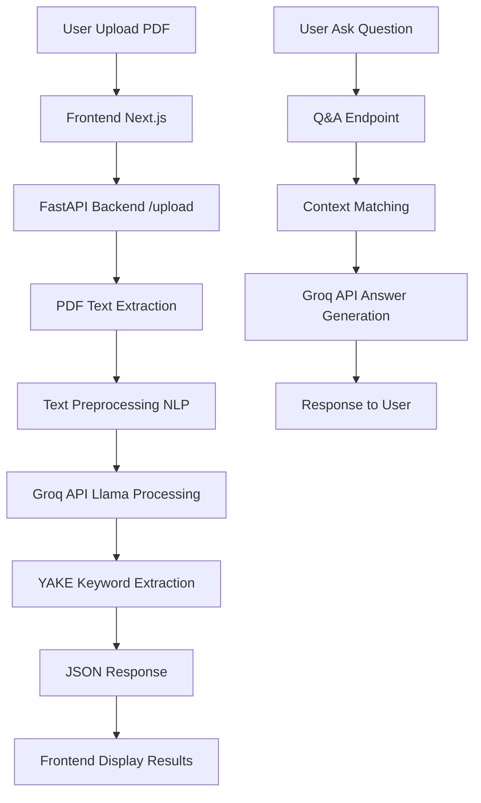

# AI Kawanuaverse - AI-Powered Academic Research Analysis

## 🎯 Deskripsi Project

ResearchMate adalah aplikasi full-stack yang membantu peneliti, mahasiswa, dan dosen menganalisis dokumen penelitian akademik secara otomatis. Aplikasi ini menggunakan **Groq API (Llama LLM)** untuk AI processing dan **Natural Language Processing (NLP)** untuk pemrosesan teks lokal.

### 🎓 Target Pengguna:
- **Peneliti**: Analisis cepat paper dan jurnal akademik
- **Mahasiswa**: Memahami isi paper untuk research dan thesis
- **Dosen**: Review dan analisis dokumen penelitian

---

## 🧠 Teknologi AI & NLP yang Digunakan

### 🚀 **AI Processing (Cloud-based)**
- **Service**: `Groq API` - Ultra-fast LLM inference
- **Model**: `Llama-3.1-8B-Instant` (Meta's efficient model)
- **Functions**: 
  - Text summarization dengan JSON response format
  - Context-aware question answering
  - Multi-language support (Indonesian + English)

### 🔧 **NLP Processing (Local)**
- **YAKE Algorithm**: Language-independent keyword extraction
- **NLTK Library**: Text tokenization dan preprocessing  
- **Functions**:
  - Text cleaning dan sentence segmentation
  - Keyword extraction dengan scoring algorithm
  - Language detection (ID/EN)
  - Fallback processing jika API tidak tersedia

---

## ✨ Fitur Utama

- **📄 PDF Text Extraction**: Extract teks dari file PDF research paper
- **📝 AI Summarization**: Ringkasan otomatis dengan Groq Llama model
- **🔍 Keyword Extraction**: Extract kata kunci penting menggunakan YAKE algorithm
- **❓ Q&A System**: Tanya jawab interaktif berdasarkan konten dokumen
- **🔐 Authentication**: JWT-based login/register system
- **🌏 Multi-language**: Support bahasa Indonesia dan English
- **📱 Responsive UI**: Interface modern dengan dark theme
- **⚡ Real-time Processing**: Upload dan analisis dengan progress tracking

---

## 🏗️ Arsitektur Sistem

### 📱 **Frontend (Next.js 15)**
```
Next.js 15 (App Router) + TypeScript
├── UI Components: shadcn/ui + Tailwind CSS
├── Animations: Framer Motion
├── State Management: React Context API
├── File Upload: react-dropzone dengan drag & drop
└── Authentication: JWT dengan custom hooks
```

### 🔧 **Backend (FastAPI)**
```
Python FastAPI + SQLAlchemy
├── Database: SQLite (dev) / PostgreSQL (prod)
├── Authentication: JWT tokens + bcrypt hashing
├── PDF Processing: PyMuPDF + pdfplumber
├── AI Integration: Groq API client
└── NLP Processing: YAKE + NLTK
```

---

## 📋 Alur Kerja (End-to-End Flow)



### 🔄 **Detail Processing Steps:**

1. **📤 PDF Upload & Validation**
   - User drag & drop PDF file ke interface
   - Frontend validasi file type dan size
   - File dikirim ke FastAPI endpoint `/documents/upload`

2. **📖 Text Extraction**
   - Backend gunakan `PyMuPDF` dan `pdfplumber` untuk extract teks
   - Text cleaning dan preprocessing dengan NLTK
   - Chunking untuk dokumen besar (>8000 characters)

3. **🤖 AI Summarization** 
   - Text dikirim ke Groq API dengan prompt dalam bahasa Indonesia
   - Llama-3.1-8B model generate ringkasan + bullet points
   - Response format JSON dengan summary dan key points

4. **🏷️ Keyword Extraction**
   - YAKE algorithm analisis text untuk extract keywords
   - Support bahasa Indonesia dan English
   - Fallback ke frequency-based extraction jika YAKE gagal

5. **❓ Question Answering**
   - User submit pertanyaan di chat interface
   - Context matching dengan dokumen yang sudah diupload
   - Groq API generate answer berdasarkan context
   - Fallback ke keyword matching jika API error

6. **📊 Results Display**
   - Frontend tampilkan hasil dalam card components
   - Interactive UI dengan smooth animations
   - Q&A chat interface seperti WhatsApp

---

## 🚀 Cara Menjalankan Project

### 📋 **Prerequisites**
- **Node.js** 18+ dan npm/yarn
- **Python** 3.8+
- **Groq API Key** (gratis di https://console.groq.com/)
- **RAM** minimum 2GB (untuk NLP processing)

### 📥 **Installation**

#### 1. Clone Repository
```bash
git clone <repository-url>
cd Test-case
```

#### 2. Setup Backend
```bash
cd backend

# Windows - jalankan startup script
start.bat

# Linux/Mac 
chmod +x start.sh
./start.sh
```

**Script akan otomatis:**
- ✅ Create Python virtual environment
- ✅ Install dependencies dari `requirements.txt`
- ✅ Setup database SQLite
- ✅ Download NLTK data
- ✅ Start FastAPI server di http://localhost:8000

#### 3. Setup Frontend
```bash
cd .. # kembali ke root directory

# Install Node.js dependencies
npm install

# Start development server
npm run dev
```

**Frontend akan running di http://localhost:3000**

#### 4. Environment Variables
```bash
# Backend - buat file .env di folder backend/
GROQ_API_KEY=your_groq_api_key_here
SECRET_KEY=your-secret-key-for-jwt
DATABASE_URL=sqlite:///./researchmate.db
```

### 🖥️ **Cara Menggunakan**

1. **Buka aplikasi**: http://localhost:3000
2. **Register/Login**: Buat akun atau login dengan akun existing
3. **Upload PDF**: Drag & drop file PDF research paper
4. **Lihat Hasil**: 
   - Summary dalam bahasa Indonesia
   - Bullet points key findings
   - Keywords sebagai tags
5. **Q&A**: Ketik pertanyaan di chat box untuk tanya jawab interaktif

---

## 🛠️ Tech Stack Detail

### **Frontend Dependencies**
```json
{
  "next": "15.5.4",
  "react": "19.1.0", 
  "typescript": "^5",
  "tailwindcss": "^4",
  "framer-motion": "^12.23.22",
  "lucide-react": "^0.544.0",
  "react-dropzone": "^14.3.8"
}
```

### **Backend Dependencies**  
```python
fastapi==0.104.1           # Web framework
groq==0.4.1               # Groq API client
yake==0.4.8               # Keyword extraction
nltk==3.8.1               # NLP preprocessing
PyMuPDF==1.23.8           # PDF processing
pdfplumber==0.10.3        # PDF text extraction
sqlalchemy==1.4.53        # Database ORM
python-jose==3.3.0        # JWT tokens
passlib[bcrypt]==1.7.4    # Password hashing
```

---

## ⚡ Performance & Specifications

### 🎯 **Processing Performance**
- **PDF Extraction**: 2-5 seconds (tergantung ukuran file)
- **AI Summarization**: 3-8 seconds (via Groq API)
- **Keyword Extraction**: 1-2 seconds (YAKE local processing)
- **Q&A Response**: 1-3 seconds (Groq API + context matching)
- **Total Analysis**: 7-18 seconds untuk dokumen typical

### 💾 **System Requirements**
- **Storage**: ~100MB untuk aplikasi + dependencies
- **RAM**: 2GB minimum, 4GB recommended
- **Internet**: Required untuk Groq API calls
- **Local NLP**: ~50MB untuk NLTK data + YAKE

### 🔥 **API Limits**
- **Groq Free Tier**: 10,000 tokens/minute
- **File Size**: Max 50MB per PDF
- **Concurrent Users**: Tergantung server specs

---

## 📂 Struktur Project

```
Test-case/
├── README.md
├── package.json
├── next.config.ts
├── tailwind.config.ts
├── src/
│   ├── app/                 # Next.js App Router
│   │   ├── page.tsx        # Homepage
│   │   ├── layout.tsx      # Root layout
│   │   └── auth/           # Auth pages
│   ├── components/         # React components
│   │   ├── ui/             # shadcn/ui components
│   │   ├── FileUpload.tsx  # PDF upload component
│   │   ├── ResultsDisplay.tsx
│   │   ├── QAComponent.tsx # Chat Q&A interface
│   │   └── Header.tsx
│   ├── contexts/
│   │   └── AuthContext.tsx # Authentication context
│   └── lib/
│       ├── api.ts          # API service functions
│       ├── types.ts        # TypeScript types
│       └── utils.ts        # Utility functions
├── backend/
│   ├── main.py             # FastAPI application
│   ├── requirements.txt    # Python dependencies
│   ├── start.bat          # Windows startup script
│   ├── start.sh           # Linux/Mac startup script
│   └── app/
│       ├── api/           # API endpoints
│       │   ├── auth.py    # Authentication routes
│       │   ├── documents.py # PDF upload/processing
│       │   └── qa.py      # Q&A endpoints
│       ├── core/
│       │   ├── config.py  # Configuration
│       │   ├── database.py # Database setup
│       │   └── security.py # JWT & auth
│       ├── models/
│       │   └── models.py  # Database models
│       ├── schemas/
│       │   └── schemas.py # Pydantic schemas
│       └── services/
│           ├── nlp_service.py # Groq API + NLP
│           └── pdf_processor.py # PDF processing
└── public/                # Static assets
```

---

## 🧪 Testing & Development

### **Available Scripts**
```bash
# Frontend
npm run dev          # Development server
npm run build        # Production build
npm run lint         # ESLint checking
npm run type-check   # TypeScript validation

# Backend  
cd backend
python main.py       # Start FastAPI server
python test_api.py   # Test API endpoints
python test_groq_integration.py # Test Groq API
```

### **API Documentation**
- **Swagger UI**: http://localhost:8000/docs
- **ReDoc**: http://localhost:8000/redoc

---

## 🎯 Development Status

### ✅ **Completed Features**
- [x] FastAPI backend dengan SQLAlchemy ORM
- [x] Next.js 15 frontend dengan TypeScript
- [x] JWT authentication system
- [x] PDF upload dan text extraction
- [x] Groq API integration untuk summarization
- [x] YAKE keyword extraction
- [x] Q&A system dengan context matching
- [x] Responsive UI dengan dark theme
- [x] Error handling dan fallback systems


---

## 🤝 Contributing

1. Fork repository
2. Create feature branch (`git checkout -b feature/NewFeature`)
3. Commit changes (`git commit -m 'Add NewFeature'`)
4. Push to branch (`git push origin feature/NewFeature`)
5. Open Pull Request

---

## 📄 License

This project is licensed under the MIT License.

---

## 👥 Team & Contact

**ResearchMate** - AI-powered academic research analysis tool

- **Frontend**: Next.js 15 + TypeScript + Tailwind CSS
- **Backend**: Python FastAPI + Groq API + NLP
- **AI**: Llama-3.1-8B via Groq API + YAKE Algorithm

---

*Built with ❤️ for the academic research community* 🎓
