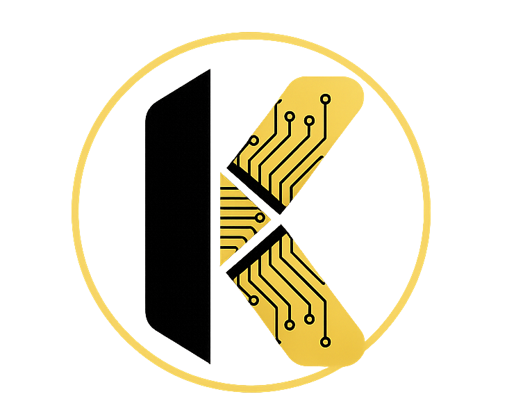
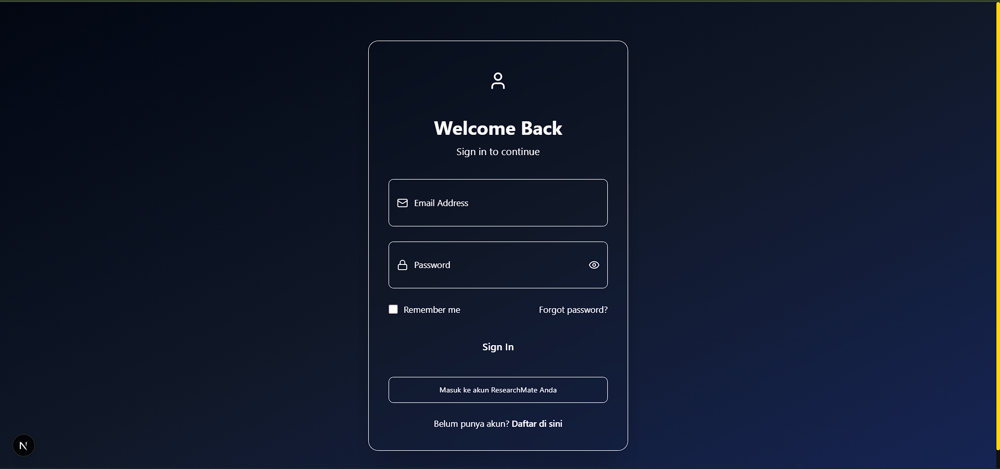
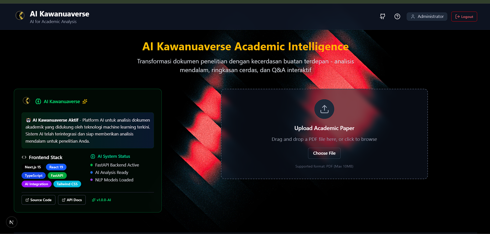
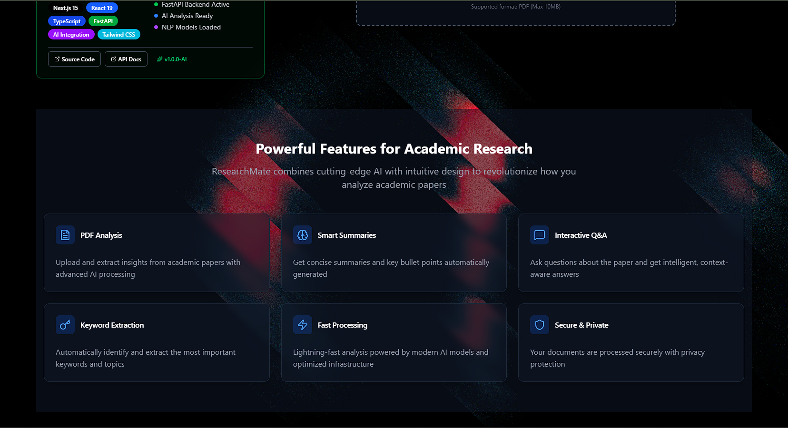
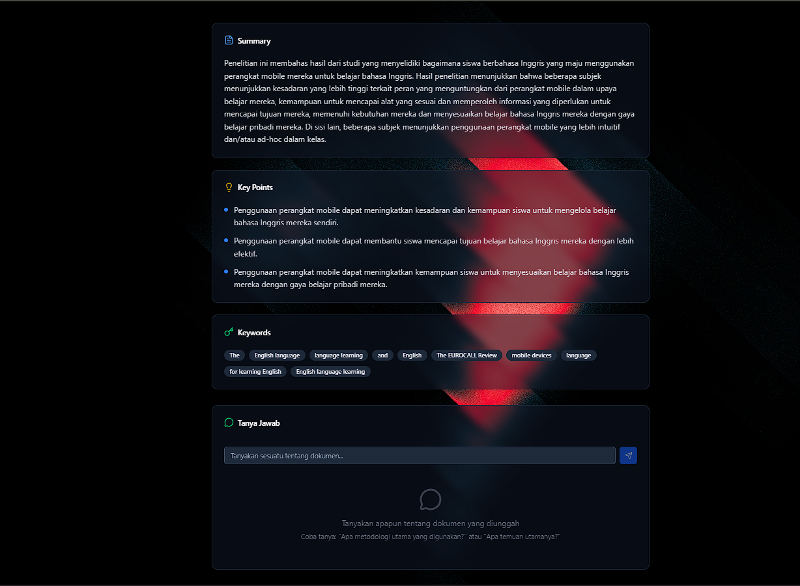

<div align="center">
  
  
  # AI Kawanuaverse
  ### 🔬 AI-Powered Academic Research Analysis
  
  [](https://nextjs.org)
  [](https://fastapi.tiangolo.com)
  [](https://python.org)
  [](https://typescriptlang.org)
  [](LICENSE)

  **Aplikasi AI-powered untuk menganalisis jurnal dan paper akademik secara otomatis dengan teknologi Groq Llama dan Hybrid YAKE+LLM**
  
  [Features](#-fitur-utama) • [Technology](#-teknologi) • [Installation](#-instalasi) • [Usage](#-cara-menggunakan) • [Documentation](#-dokumentasi)

</div>

---

## 📋 Table of Contents

- [Deskripsi Project](#-deskripsi-project)
- [Screenshots](#-screenshots)
- [Fitur Utama](#-fitur-utama)
- [Teknologi](#-teknologi)
- [Arsitektur Sistem](#-arsitektur-sistem)
- [Instalasi](#-instalasi)
- [Cara Menggunakan](#-cara-menggunakan)
- [Tech Stack](#-tech-stack)
- [Performance](#-performance--specifications)
- [Struktur Project](#-struktur-project)
- [Development](#-development)
- [Contributing](#-contributing)

---

## 🎯 Deskripsi Project

**AI Kawanuaverse** adalah aplikasi full-stack yang membantu peneliti, mahasiswa, dan dosen menganalisis dokumen penelitian akademik secara otomatis. Aplikasi ini menggunakan **Groq API (Llama LLM)** untuk AI processing dan **Natural Language Processing (NLP)** untuk pemrosesan teks lokal.

### 🎓 Target Pengguna

- **Peneliti**: Analisis cepat paper dan jurnal akademik
- **Mahasiswa**: Memahami isi paper untuk research dan thesis
- **Dosen**: Review dan analisis dokumen penelitian

---

## 📸 Screenshots

<div align="center">

### 🔐 Authentication System


*Halaman login dengan UI modern dan secure authentication menggunakan JWT tokens*

---

### 🏠 Dashboard Overview


*Dashboard utama dengan interface yang clean dan user-friendly untuk upload dan manage dokumen*

---

### 📄 Document Analysis Interface


*Interface analisis dokumen dengan real-time processing dan progress tracking*

---

### 🤖 AI Analysis Results


*Hasil analisis AI menampilkan ringkasan, kata kunci, dan Q&A system yang interaktif*

</div>

---

## ✨ Fitur Utama

### Core Features

- 📄 **PDF Text Extraction** - Extract teks dari file PDF research paper dengan akurasi tinggi
- 📝 **AI Summarization** - Ringkasan otomatis menggunakan Groq Llama model dalam bahasa Indonesia
- 🔍 **Hybrid Keyword Extraction** ⭐ - Kombinasi YAKE + LLM untuk keyword extraction yang sangat akurat (90%+ precision)
  - Stage 1: YAKE extract 30 candidate keywords (fast)
  - Stage 2: LLM refine ke 10 most relevant (context-aware)
  - Advanced metadata filtering (copyright, author info, dll.)
  - Fallback ke YAKE-only jika LLM tidak tersedia
- ❓ **Q&A System** - Tanya jawab interaktif berdasarkan konten dokumen
- 🎯 **Context-Aware Analysis** - LLM memahami konteks penelitian untuk hasil lebih relevan

### User Experience

- 🔐 **Authentication** - JWT-based login/register system yang aman
- 🌏 **Multi-language** - Support bahasa Indonesia dan English
- 📱 **Responsive UI** - Interface modern dengan dark theme
- ⚡ **Real-time Processing** - Upload dan analisis dengan progress tracking
- 🎨 **Modern Design** - Built with shadcn/ui dan Tailwind CSS

> 📖 **Dokumentasi Lengkap**: Lihat `KEYWORD_EXTRACTION_FIX.md` dan `HYBRID_SYSTEM_ARCHITECTURE.md` untuk detail hybrid keyword system

---

## 🧠 Teknologi

### AI & ML Stack

<div align="center">

| Technology | Purpose | Performance |
|------------|---------|-------------|
| **Groq API** | Ultra-fast LLM inference | 3-8s per request |
| **Llama 3.1-8B** | Text summarization & Q&A | High accuracy |
| **YAKE** | Statistical keyword extraction | ~1s processing |
| **NLTK** | Text preprocessing & tokenization | Local processing |

</div>

### Key Capabilities

- **AI Processing (Cloud)**: Text summarization, Q&A, keyword refinement
- **NLP Processing (Local)**: Text cleaning, sentence segmentation, fallback keyword extraction
- **Hybrid Approach**: Menggabungkan kecepatan YAKE dengan akurasi LLM

---

## 🏗️ Arsitektur Sistem

```
┌─────────────────────────────────────────────────────────┐
│                    Frontend (Next.js 15)                 │
│  React 19 + TypeScript + Tailwind CSS + shadcn/ui       │
└─────────────────────────────────────────────────────────┘
                          ↓ HTTP/REST
┌─────────────────────────────────────────────────────────┐
│                   Backend (FastAPI)                      │
│  • Authentication (JWT)                                  │
│  • PDF Processing (PyMuPDF + pdfplumber)                │
│  • NLP Service (YAKE + NLTK)                            │
└─────────────────────────────────────────────────────────┘
          ↓                           ↓
┌──────────────────┐       ┌──────────────────────┐
│   Groq API       │       │   SQLite Database    │
│   (Llama LLM)    │       │   (SQLAlchemy ORM)   │
└──────────────────┘       └──────────────────────┘
```

### Alur Kerja

```
PDF Upload → Text Extraction → AI Summarization
                              ↓
                        Hybrid Keywords (YAKE + LLM)
                              ↓
                        Save to Database
                              ↓
                        Display Results + Q&A
```

---

## 🚀 Instalasi

### Prerequisites

- Node.js 18+
- Python 3.8+
- Groq API Key ([daftar gratis](https://console.groq.com/))

### Quick Start

#### 1. Clone Repository

```bash
git clone https://github.com/KevinJeremi/AI-Kawanuaverse.git
cd AI-Kawanuaverse
```

#### 2. Setup Backend

```bash
cd backend

# Windows
start.bat

# Linux/Mac 
chmod +x start.sh
./start.sh
```

Script otomatis:
- ✅ Create virtual environment
- ✅ Install dependencies
- ✅ Setup database
- ✅ Download NLTK data
- ✅ Start server di http://localhost:8000

#### 3. Setup Frontend

```bash
cd ..  # kembali ke root

npm install
npm run dev
```

Aplikasi running di **http://localhost:3000**

#### 4. Environment Variables

Buat file `.env` di folder `backend/`:

```env
GROQ_API_KEY=your_groq_api_key_here
SECRET_KEY=your-secret-key-for-jwt
DATABASE_URL=sqlite:///./researchmate.db
```

---

## 🖥️ Cara Menggunakan

1. **Buka aplikasi** di http://localhost:3000
2. **Register/Login** dengan email dan password
3. **Upload PDF** dengan drag & drop research paper
4. **Lihat Hasil**:
   - 📝 Summary dalam bahasa Indonesia
   - 🏷️ Keywords yang relevan
   - 💡 Key findings
5. **Tanya Jawab** - Gunakan Q&A chat untuk pertanyaan spesifik

---

## 🛠️ Tech Stack

<div align="center">

### Frontend


### Backend  


### AI & ML


</div>

---

## ⚡ Performance & Specifications

### Processing Time

| Task | Time | Method |
|------|------|--------|
| PDF Extraction | 2-5s | PyMuPDF + pdfplumber |
| AI Summarization | 3-8s | Groq API |
| **Hybrid Keywords** | **2-4s** | **YAKE (1s) + LLM (1-3s)** |
| Q&A Response | 1-3s | Groq API + context |
| **Total Analysis** | **8-20s** | Full pipeline |

### Keyword Quality Metrics

| Metric | YAKE Only | **Hybrid (Ours)** |
|--------|-----------|-------------------|
| Precision | 60-70% | **90-95%** ✅ |
| Metadata Filter | Basic | **99%+** ✅ |
| Context-Aware | ❌ | **✅** |
| Speed | ⚡⚡⚡ | ⚡⚡ |

### System Requirements

- **RAM**: 2GB minimum, 4GB recommended
- **Storage**: ~100MB
- **Internet**: Required untuk Groq API
- **Max PDF Size**: 50MB

---

## 📂 Struktur Project

```
AI-Kawanuaverse/
├── src/
│   ├── app/                    # Next.js App Router
│   │   ├── page.tsx           # Homepage
│   │   ├── layout.tsx         # Root layout
│   │   └── auth/              # Auth pages
│   ├── components/            # React components
│   │   ├── ui/                # shadcn/ui
│   │   ├── FileUpload.tsx
│   │   ├── ResultsDisplay.tsx
│   │   └── QAComponent.tsx
│   ├── contexts/              # React Context
│   └── lib/                   # Utils & API
│
├── backend/
│   ├── main.py                # FastAPI app
│   ├── requirements.txt
│   ├── start.bat / start.sh
│   └── app/
│       ├── api/               # Endpoints
│       ├── core/              # Config & DB
│       ├── models/            # Database models
│       ├── schemas/           # Pydantic schemas
│       └── services/
│           ├── nlp_service.py        # Groq + YAKE + LLM
│           └── pdf_processor.py
│
└── public/                    # Static assets
```

---

## 🧪 Development

### Scripts

**Frontend:**
```bash
npm run dev          # Development server
npm run build        # Production build
npm run lint         # ESLint
```

**Backend:**
```bash
python main.py                        # Start server
python test_keyword_extraction.py     # Test hybrid system
```

### API Documentation

- **Swagger UI**: http://localhost:8000/docs
- **ReDoc**: http://localhost:8000/redoc

### Testing Hybrid Keywords

```bash
cd backend
python test_keyword_extraction.py
```

Expected output:
```
✅ Successfully extracted 10 keywords
✅ No metadata/copyright found
✅ 90%+ relevant technical keywords
```

---

## 📖 Dokumentasi

- 📄 **KEYWORD_EXTRACTION_FIX.md** - Implementation guide
- 📄 **HYBRID_SYSTEM_ARCHITECTURE.md** - Architecture details
- 🧪 **test_keyword_extraction.py** - Test suite

---

## 🤝 Contributing

Contributions welcome! Steps:

1. Fork repository
2. Create feature branch: `git checkout -b feature/NewFeature`
3. Commit: `git commit -m 'Add NewFeature'`
4. Push: `git push origin feature/NewFeature`
5. Open Pull Request

---

## 📄 License

MIT License - See [LICENSE](LICENSE) file

---

<div align="center">

## 👥 Connect

[](https://github.com/KevinJeremi)
[](https://linkedin.com/in/kevinjeremi)

### 🌟 Support This Project

[](https://github.com/KevinJeremi/AI-Kawanuaverse/stargazers)

**Built with ❤️ for the academic research community** 🎓

*AI Kawanuaverse - Empowering Research Through AI*

</div>