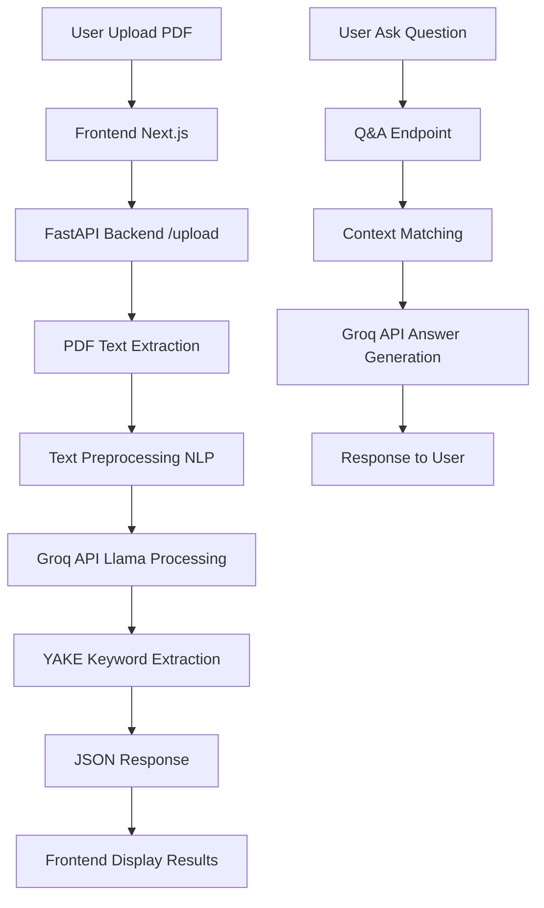

<div align="center">
  
  
  # AI Kawanuaverse
  ### 🔬 AI-Powered Academic Research Analysis
  
  [](https://nextjs.org)
  [](https://fastapi.tiangolo.com)
  [](https://python.org)
  [](https://typescriptlang.org)
  [](LICENSE)

  **Aplikasi AI-powered untuk menganalisis jurnal dan paper akademik secara otomatis dengan teknologi Groq Llama dan NLP**
  
  [Features](#-fitur-utama) • [Technology](#-teknologi-ai--nlp) • [Installation](#-instalasi) • [Usage](#-cara-menggunakan) • [Architecture](#-arsitektur-sistem)

</div>

---

## 📋 Table of Contents

- [Deskripsi Project](#-deskripsi-project)
- [Fitur Utama](#-fitur-utama)
- [Teknologi AI & NLP](#-teknologi-ai--nlp)
- [Arsitektur Sistem](#-arsitektur-sistem)
- [Alur Kerja](#-alur-kerja)
- [Instalasi](#-instalasi)
- [Cara Menggunakan](#-cara-menggunakan)
- [Tech Stack](#-tech-stack)
- [Performance](#-performance--specifications)
- [Struktur Project](#-struktur-project)
- [Development](#-development)
- [Contributing](#-contributing)
- [License](#-license)

---

## 🎯 Deskripsi Project

**AI Kawanuaverse** (ResearchMate) adalah aplikasi full-stack yang membantu peneliti, mahasiswa, dan dosen menganalisis dokumen penelitian akademik secara otomatis. Aplikasi ini menggunakan **Groq API (Llama LLM)** untuk AI processing dan **Natural Language Processing (NLP)** untuk pemrosesan teks lokal.

### 🎓 Target Pengguna

- **Peneliti**: Analisis cepat paper dan jurnal akademik
- **Mahasiswa**: Memahami isi paper untuk research dan thesis
- **Dosen**: Review dan analisis dokumen penelitian

### 📊 Project Statistics


---

## ✨ Fitur Utama

- 📄 **PDF Text Extraction** - Extract teks dari file PDF research paper
- 📝 **AI Summarization** - Ringkasan otomatis dengan Groq Llama model
- 🔍 **Keyword Extraction** - Extract kata kunci penting menggunakan YAKE algorithm
- ❓ **Q&A System** - Tanya jawab interaktif berdasarkan konten dokumen
- 🔐 **Authentication** - JWT-based login/register system
- 🌏 **Multi-language** - Support bahasa Indonesia dan English
- 📱 **Responsive UI** - Interface modern dengan dark theme
- ⚡ **Real-time Processing** - Upload dan analisis dengan progress tracking

---

## 🧠 Teknologi AI & NLP

### 🚀 AI Processing (Cloud-based)

- **Service**: Groq API - Ultra-fast LLM inference
- **Model**: Llama-3.1-8B-Instant (Meta's efficient model)
- **Functions**: 
  - Text summarization dengan JSON response format
  - Context-aware question answering
  - Multi-language support (Indonesian + English)

### 🔧 NLP Processing (Local)

- **YAKE Algorithm**: Language-independent keyword extraction
- **NLTK Library**: Text tokenization dan preprocessing  
- **Functions**:
  - Text cleaning dan sentence segmentation
  - Keyword extraction dengan scoring algorithm
  - Language detection (ID/EN)
  - Fallback processing jika API tidak tersedia

---

## 🏗️ Arsitektur Sistem

### Frontend (Next.js 15)

```
Next.js 15 (App Router) + TypeScript
├── UI Components: shadcn/ui + Tailwind CSS
├── Animations: Framer Motion
├── State Management: React Context API
├── File Upload: react-dropzone dengan drag & drop
└── Authentication: JWT dengan custom hooks
```

### Backend (FastAPI)

```
Python FastAPI + SQLAlchemy
├── Database: SQLite (dev) / PostgreSQL (prod)
├── Authentication: JWT tokens + bcrypt hashing
├── PDF Processing: PyMuPDF + pdfplumber
├── AI Integration: Groq API client
└── NLP Processing: YAKE + NLTK
```

---

## 📋 Alur Kerja



### Detail Processing Steps

1. **📤 PDF Upload & Validation**
   - User drag & drop PDF file ke interface
   - Frontend validasi file type dan size
   - File dikirim ke FastAPI endpoint `/documents/upload`

2. **📖 Text Extraction**
   - Backend gunakan PyMuPDF dan pdfplumber untuk extract teks
   - Text cleaning dan preprocessing dengan NLTK
   - Chunking untuk dokumen besar (>8000 characters)

3. **🤖 AI Summarization** 
   - Text dikirim ke Groq API dengan prompt dalam bahasa Indonesia
   - Llama-3.1-8B model generate ringkasan + bullet points
   - Response format JSON dengan summary dan key points

4. **🏷️ Keyword Extraction**
   - YAKE algorithm analisis text untuk extract keywords
   - Support bahasa Indonesia dan English
   - Fallback ke frequency-based extraction jika YAKE gagal

5. **❓ Question Answering**
   - User submit pertanyaan di chat interface
   - Context matching dengan dokumen yang sudah diupload
   - Groq API generate answer berdasarkan context
   - Fallback ke keyword matching jika API error

6. **📊 Results Display**
   - Frontend tampilkan hasil dalam card components
   - Interactive UI dengan smooth animations
   - Q&A chat interface seperti WhatsApp

---

## 🚀 Instalasi

### Prerequisites

- Node.js 18+ dan npm/yarn
- Python 3.8+
- Groq API Key (gratis di https://console.groq.com/)
- RAM minimum 2GB (untuk NLP processing)

### Setup Instructions

#### 1. Clone Repository

```bash
git clone https://github.com/KevinJeremi/AI-Kawanuaverse.git
cd AI-Kawanuaverse
```

#### 2. Setup Backend

```bash
cd backend

# Windows
start.bat

# Linux/Mac 
chmod +x start.sh
./start.sh
```

Script akan otomatis:
- ✅ Create Python virtual environment
- ✅ Install dependencies dari requirements.txt
- ✅ Setup database SQLite
- ✅ Download NLTK data
- ✅ Start FastAPI server di http://localhost:8000

#### 3. Setup Frontend

```bash
cd ..  # kembali ke root directory

# Install dependencies
npm install

# Start development server
npm run dev
```

Frontend akan running di http://localhost:3000

#### 4. Environment Variables

Buat file `.env` di folder `backend/`:

```env
GROQ_API_KEY=your_groq_api_key_here
SECRET_KEY=your-secret-key-for-jwt
DATABASE_URL=sqlite:///./researchmate.db
```

---

## 🖥️ Cara Menggunakan

1. **Buka aplikasi** di http://localhost:3000
2. **Register/Login** dengan akun baru atau existing
3. **Upload PDF** dengan drag & drop file research paper
4. **Lihat Hasil Analisis**:
   - Summary dalam bahasa Indonesia
   - Bullet points key findings
   - Keywords sebagai tags
5. **Q&A Interaktif** - Ketik pertanyaan di chat box untuk tanya jawab

---

## 🛠️ Tech Stack

<div align="center">

### Frontend


### Backend  


### AI & ML


</div>

### Key Dependencies

**Frontend:**
- Next.js 15.5.4
- React 19.1.0
- TypeScript 5+
- Tailwind CSS 4+
- Framer Motion 12.23.22
- Lucide React 0.544.0

**Backend:**
- FastAPI 0.104.1
- Groq 0.4.1
- YAKE 0.4.8
- NLTK 3.8.1
- PyMuPDF 1.23.8
- SQLAlchemy 1.4.53

---

## ⚡ Performance & Specifications

### Processing Performance

- **PDF Extraction**: 2-5 seconds (tergantung ukuran file)
- **AI Summarization**: 3-8 seconds (via Groq API)
- **Keyword Extraction**: 1-2 seconds (YAKE local processing)
- **Q&A Response**: 1-3 seconds (Groq API + context matching)
- **Total Analysis**: 7-18 seconds untuk dokumen typical

### System Requirements

- **Storage**: ~100MB untuk aplikasi + dependencies
- **RAM**: 2GB minimum, 4GB recommended
- **Internet**: Required untuk Groq API calls
- **Local NLP**: ~50MB untuk NLTK data + YAKE

### API Limits

- **Groq Free Tier**: 10,000 tokens/minute
- **File Size**: Max 50MB per PDF
- **Concurrent Users**: Tergantung server specs

---

## 📂 Struktur Project

```
AI-Kawanuaverse/
├── README.md
├── package.json
├── next.config.ts
├── tailwind.config.ts
├── src/
│   ├── app/                    # Next.js App Router
│   │   ├── page.tsx           # Homepage
│   │   ├── layout.tsx         # Root layout
│   │   └── auth/              # Auth pages
│   ├── components/            # React components
│   │   ├── ui/                # shadcn/ui components
│   │   ├── FileUpload.tsx     # PDF upload component
│   │   ├── ResultsDisplay.tsx
│   │   ├── QAComponent.tsx    # Chat Q&A interface
│   │   └── Header.tsx
│   ├── contexts/
│   │   └── AuthContext.tsx    # Authentication context
│   └── lib/
│       ├── api.ts             # API service functions
│       ├── types.ts           # TypeScript types
│       └── utils.ts           # Utility functions
├── backend/
│   ├── main.py                # FastAPI application
│   ├── requirements.txt       # Python dependencies
│   ├── start.bat             # Windows startup script
│   ├── start.sh              # Linux/Mac startup script
│   └── app/
│       ├── api/              # API endpoints
│       │   ├── auth.py       # Authentication routes
│       │   ├── documents.py  # PDF upload/processing
│       │   └── qa.py         # Q&A endpoints
│       ├── core/
│       │   ├── config.py     # Configuration
│       │   ├── database.py   # Database setup
│       │   └── security.py   # JWT & auth
│       ├── models/
│       │   └── models.py     # Database models
│       ├── schemas/
│       │   └── schemas.py    # Pydantic schemas
│       └── services/
│           ├── nlp_service.py    # Groq API + NLP
│           └── pdf_processor.py  # PDF processing
└── public/                   # Static assets
```

---

## 🧪 Development

### Available Scripts

**Frontend:**
```bash
npm run dev          # Development server
npm run build        # Production build
npm run lint         # ESLint checking
npm run type-check   # TypeScript validation
```

**Backend:**
```bash
cd backend
python main.py       # Start FastAPI server
python test_api.py   # Test API endpoints
python test_groq_integration.py  # Test Groq API
```

### API Documentation

- **Swagger UI**: http://localhost:8000/docs
- **ReDoc**: http://localhost:8000/redoc

### Development Status

#### ✅ Completed Features
- [x] FastAPI backend dengan SQLAlchemy ORM
- [x] Next.js 15 frontend dengan TypeScript
- [x] JWT authentication system
- [x] PDF upload dan text extraction
- [x] Groq API integration untuk summarization
- [x] YAKE keyword extraction
- [x] Q&A system dengan context matching
- [x] Responsive UI dengan dark theme
- [x] Error handling dan fallback systems

---

## 🤝 Contributing

Contributions are welcome! Please follow these steps:

1. Fork the repository
2. Create feature branch (`git checkout -b feature/NewFeature`)
3. Commit changes (`git commit -m 'Add NewFeature'`)
4. Push to branch (`git push origin feature/NewFeature`)
5. Open Pull Request

---

## 📄 License

This project is licensed under the MIT License. See [LICENSE](LICENSE) file for details.

---

## 👥 Connect With Us

<div align="center">

[](https://github.com/KevinJeremi)
[](https://linkedin.com/in/kevinjeremi)
[](mailto:kevin@example.com)

### 🌟 Show Your Support

If this project helped you, please consider giving it a ⭐️!

[](https://github.com/KevinJeremi/AI-Kawanuaverse/stargazers)

</div>

---

<div align="center">

**Built with ❤️ for the academic research community** 🎓

*AI Kawanuaverse - Empowering Research Through AI*

</div>
